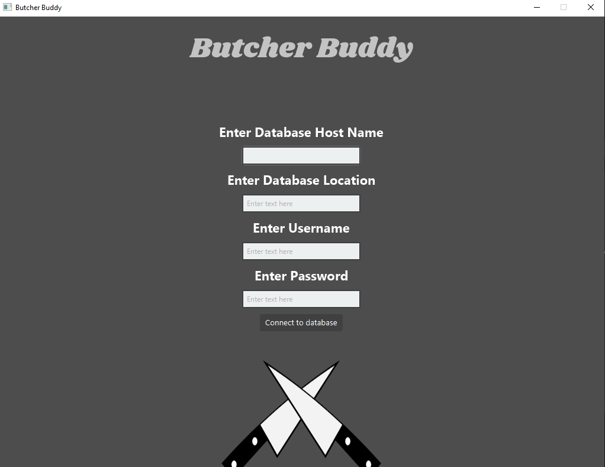
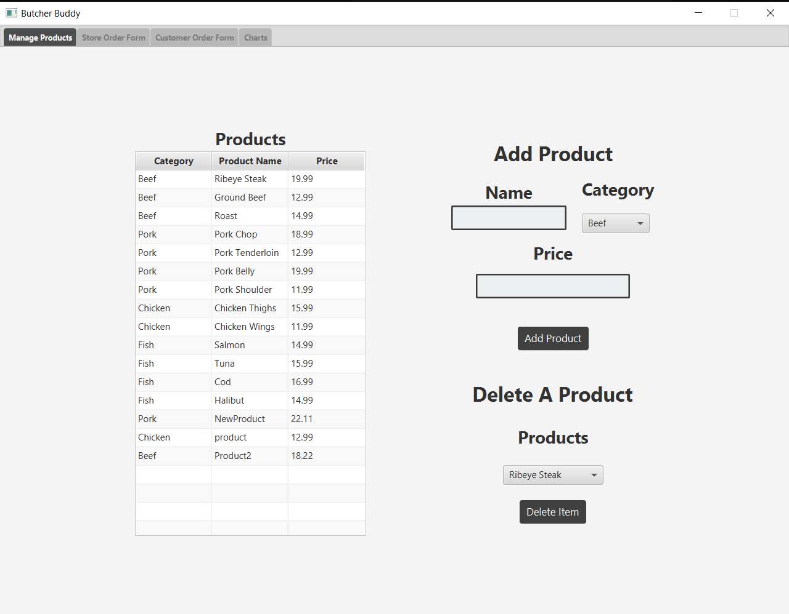
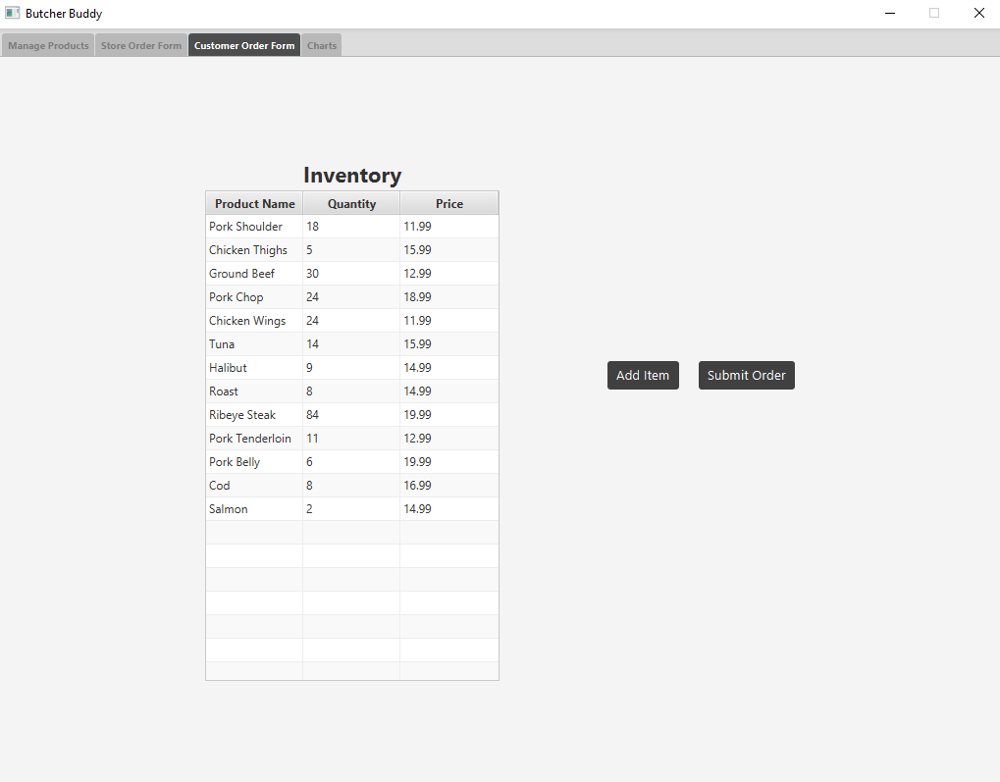
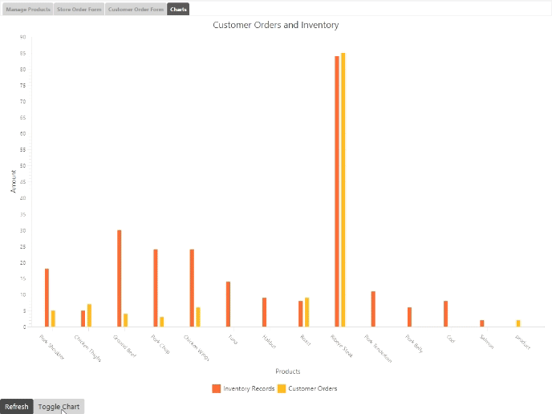

# Butcher Buddy

Welcome to Butcher Buddy, this application is made to create, update and delete different meats inside of a database.

## Logging into Database

On startup, the user is meant to login to the specified Database using the database location, database username, and database password.
When the user signs in, their credentials are saved in a file named DBC.txt, this file is then read and used to bypass the login page, making this app more user friendly.

## Adding and ordering Products

Upon login, the user is prompted to create a product inside of one of the preset categories, after the user creates a product, they can order said product to the stores inventory.
When the user orders a product, the product, aswell as the quantity and the accumulated price is added to the inventory form.

## Customer order form

When a customer wants to order an item, the user inputs the Product, and quantity of the order, and it removes values from the stores inventory.

## Charts and Stats

The charts tab displays different information about the customers orders, inventory values and products inside of the stores inventory

## Authors

- [@Evan-Proulx](https://github.com/Evan-Proulx)
- [@uathan](https://github.com/uathan)

